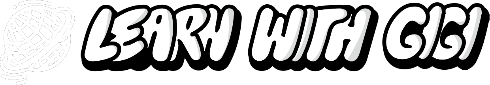

# 🌎 LEARN WITH GIGI

Progetto per imparare threejs & altre tecnologie.
## ⌨️ Avvia in locale
Clona il progetto in HTTPS

```bash
  git clone https://github.com/luigicarmone/lwg-backend.git
```
oppure SSH & GitHub CLI

```bash
  SSH: git clone git@github.com:luigicarmone/lwg-backend.git
  GitHub CLI: gh repo clone luigicarmone/lwg-backend
```

Vai alla directory

```bash
  cd lwg-backend
```

Installa le dipendenze

```bash
  composer update
```

Starta il progetto con docker.


## 📧 Feedback

Se hai commenti, contattami all'email luigicarmone16@gmail.com

## ⚙️ Tech Stack

**Client:** ThreeJS, React Three Fiber, React, TailwindCSS, Vite, Framer Motion, NextUI,

**Server:** Symfony, NGINX.

**Database:** PostgreSQL
## 🪪 License

[MIT](https://choosealicense.com/licenses/mit/)


## ✍🏻 Autori

- [@luigicarmone](https://www.github.com/luigicarmone)
